## Présentation

Bonjour et bienvenue,

Voici un aperçu de mon parcours et de mes réalisations.
Vous pouvez également consulter mon blog de présentation pour découvrir plus en détail mon univers et mes projets.
- [Mon blog de présentation](https://lienhartm.github.io/lm/).

---

### Projets réalisés pour des associations et entreprises :

- **Questionnaire - Association Caritas**
- **CRM - Design Concept**
- **Suivi Evenement Sportif - Hopla Cup**
- **Gestion locative - Cavalons**
- **Gestion administrative - Génération Mouvement 68**
- **Gamification - EasyBetMe**
- **Gestion locative - InsoliteSPA68**
- **Website - Ski Club de Guebwiller**

---

### Puis des projet personnel comme :

- **Website : Délices de nos rivières**
- **Website : BasketBall**
- **Jeu : MasterMind**
- **Cloud : BlocNote**
- **Jeu : Survivor**
- **Mini diapo auto de pésentation : Epicur** ***Persolo***

---

### Des projets FabLab' au sein du [Technistub](https://technistub.org/) :

- PhotoBooth
- Makerfight

---

### Les formations :

- [CNAM](https://www.cnam.fr/portail/conservatoire-national-des-arts-et-metiers-accueil-821166.kjsp) : webmestre junior
- [UHA4.0](https://www.fst.uha.fr/index.php/du/) : développement logiciel en mode gestion de projet
- [FABLAB](https://technistub.org/) : projets, impression 3D, DAO, ...
- [ELAN](https://elan-formation.fr/accueil) : développement web et web mobile
- [STUDI](https://www.studi.com/fr) : graduate technicien supérieur système, réseaux et cybersécurité

---

### Veille et perfectionnement continu :

- [W3School](https://www.w3schools.com/)
- [CodeCademy](https://www.codecademy.com/)
- [FreeCodeCamp](https://www.freecodecamp.org/)
- [Sololearn](https://www.sololearn.com/fr/)
- [Mimo](https://mimo.org/)
- [Coddy](https://coddy.tech/)
- [RootMe](https://www.root-me.org/)
- [Netacad](https://www.netacad.com/)

---

### Engagement bénévole :

- FabLab' - MakerFight / Technistub
- Caritatif - Caritas

---

Toujours prêt a vous soutenir dans vos ambitions, vous pouvez me contactez via mon site pour que nous puissions échanger et construire ensemble votre projet numérique.

---

  

    
GitHub

    
  

  

---

<!--
URL top_langs : https://github-readme-stats-9q6fyhj7z-lienhartm-7a55747f.vercel.app/api/top-langs?username=lienhartm&count_private=true&layout=compact&langs_count=30

URL ranks : https://github-readme-stats-9q6fyhj7z-lienhartm-7a55747f.vercel.app/api?username=lienhartm&count_private=true&include_all_commits=true&show=reviews,prs_merged,prs_merged_percentage

-->

